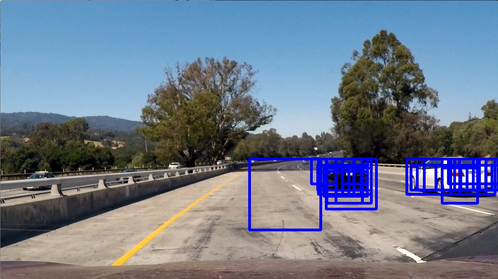
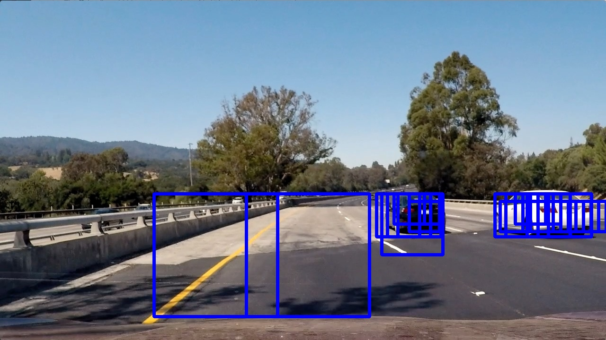

## Vehicle Detection
In this project, I built an image processing pipeline to detect vehicles in a video stream taken from a front-mounted
camera on a car. I extracted histogram-of-oriented gradients (HOG) features from sample car and non-car images, and used
them to train a linear SVM. Then I applied the SVM on windows of various scales in the input image to detect areas that
were likely to be cars.

My code for this project is in [this Jupyter Notebook](project.ipynb).

### Histogram of Oriented Gradients (HOG)

For each 64x64 image in the supplied dataset of ~8000 car and ~8000 non-car images, I generated a feature vector using
a Histogram of Oriented Gradients (HOG) technique. I first converted each image to the YCrCb color space, and then
generated a HOG for each channel. I used 8x8 cells, 2x2 blocks, and 9 orientations for the HOG, for a total of 1764
features.

The code for this step is in the classes `FeatureExtractorUnnormalized` and `FeatureExtractor`.

Here is an example of a vehicle with HOG features. The upper right is the "Y" channel, the lower left is the "Cr"
channel, and the lower right is the "Cb" channel:

Here is an example of a non-vehicle:

 

I initially tried using a HOG on a grayscale version of the image (essentially just the Y channel) but I found that
using YCrCb gave a higher accuracy (~97% vs ~92% on the test segment of the dataset).

### Color Histogram

For each image, I computed a color histogram in the LUV color space, with 32 histogrm bins for each channel. This
produced a vector of 96 features for each image.

### Color Spatial Binning

For each image, I resized the image to 16x16 and took the LUV channel values for each pixel, producing a 768-value
feature vector per image.

### Normalization
After extracting the HOG, color histogram, and spatially binned color features, I normalized them across my dataset so
that the mean for each feature was zero and the variance was one. The total number of featues was 

### SVM

I trained a linear SVM on the normalized features, using 80% of the data for training and 20% for testing.
In total there were 2628 features.

I set the parameter `C` to `0.01` to improve the generalization of the model, and I achieved an
accuracy of ~99.7% on the test data.

### Sliding Window Search

I then generated a list of square windows to search on the input image. The windows were restricted to the
region-of-interest, which is roughly the lower half of the image. Smaller windows were restricted to the upper part of
the ROI (since cars can only appear at that scale if they are near the top of the ROI). Here's an image that visualizes
a random subset (10%) of the windows:

Here are some example images from the front-facing camera showing windows that were identified as containing a car:

### Heatmap

I then counted the number of bounding boxes that overlapped each pixel. This generated a heatmap of areas in the image
that were likely to be cars:

From there, I took a threshold on the number of overlapping bounding boxes. I found that 3 worked well:

By eliminating areas that were only overlapped by 1 or 2 windows that the SVM thought were cars, I helped eliminate
false positives.

### Floodfill to get Vehicle Bounding Boxes

After thresholding, I performed a morphological close, because I noticed that in some cases cars would be represented by
multiple "islands" that were separated by a narrow "channel"; the close operation helped join these together.

Afterwards I did a floodfill to identify distinct islands in the thresholded image, and drew a bounding box around them:

### Video Implementation

I then ran my pipeline on a video. To decrease the number of false positives, I averaged the heatmap values over a
10-frame window and applied the same threshold (3). This is the result:

---

### Discussion

The biggest difficulty in this project was the amount of time that the pipeline took to run. Processing 1 second of
video (25 frames) took 2 minutes, so the processing the entire 50-second video took around an hour and a half, even
on a dedicated `c3.2xlarge` server.
Profiling the code, I found that roughly 75% of the time was spent in the "predict" function of the SVM and 25% was
spent generating the HOG features.

One approach I took to try to fix this was splitting the video into pieces and using the `multiprocessing` module to
process them separately. I had trouble getting this working, however, and ended up just waiting.

Also, I had trouble getting sufficient accuracy at first in order to consistently identify cars in the video stream.
Adding color histogram and spatial color bin features helped boost my accuracy.

One area where my pipeline could fail is if the terrain is hilly, since it assumes cars are in a fixed area in the
camera image. If there is an upcoming hill, cars on the hill would not be detected. I could fix this by searching a
larger area, but this would make the pipeline even slower.
